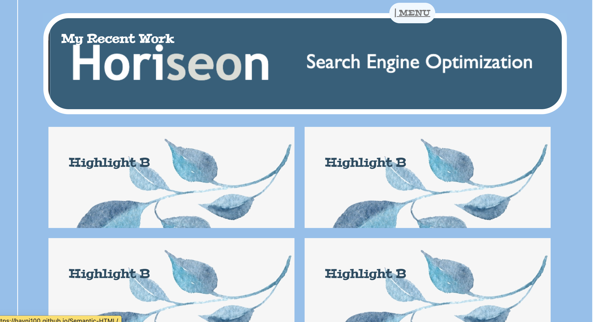

# Haein's Professional Portfolio Page
 https://hayni100.github.io/Professional-portfolio/

## Description

This is Haein Kim's porfolio page which will be used to showcase her skills and deployed web applications for future customers and employers to view.

## Installation

N/A

## Usage

To use this portfolio page, you can navigate to developer's works and her contact info via the navigation toolbar. You can also use the 'menu' button in the top middle to navigate back to the home toolbar. Users can enter different deployed sites by clicking on the images of the developer's works. In the contact section, you can click on 'send email' button to directly open an e-mail application that's pre-filled with the developer's email address.

## Credits

N/A

## License

MIT License

Copyright (c) [2022] [HaeinKim]

Permission is hereby granted, free of charge, to any person obtaining a copy
of this software and associated documentation files (the "Software"), to deal
in the Software without restriction, including without limitation the rights
to use, copy, modify, merge, publish, distribute, sublicense, and/or sell
copies of the Software, and to permit persons to whom the Software is
furnished to do so, subject to the following conditions:

The above copyright notice and this permission notice shall be included in all
copies or substantial portions of the Software.

THE SOFTWARE IS PROVIDED "AS IS", WITHOUT WARRANTY OF ANY KIND, EXPRESS OR
IMPLIED, INCLUDING BUT NOT LIMITED TO THE WARRANTIES OF MERCHANTABILITY,
FITNESS FOR A PARTICULAR PURPOSE AND NONINFRINGEMENT. IN NO EVENT SHALL THE
AUTHORS OR COPYRIGHT HOLDERS BE LIABLE FOR ANY CLAIM, DAMAGES OR OTHER
LIABILITY, WHETHER IN AN ACTION OF CONTRACT, TORT OR OTHERWISE, ARISING FROM,
OUT OF OR IN CONNECTION WITH THE SOFTWARE OR THE USE OR OTHER DEALINGS IN THE
SOFTWARE.
